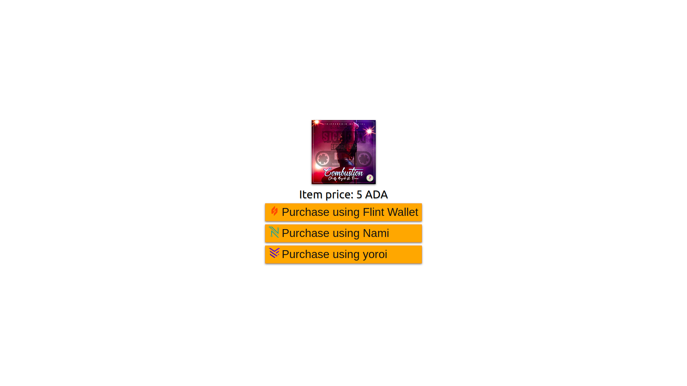
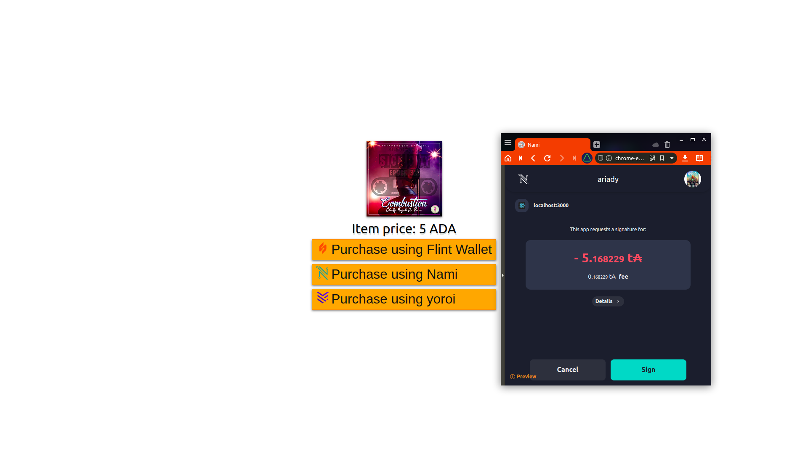

# purchase-button-plugin
Fully front-end [`PurchaseButton`](src/component/PurchaseButton.js) React component:


NOTE: Pop-up window depends on the client's browser, wallet extension used, and system configurations. It may fail to steal focus.

## How to integrate
Take a look at [`App.js`](src/App.js#L16):
```js
<PurchaseButton txInfo={{
  toAddress : 'addr_test1qp75v9ld0084zl07kwjyfnwagm7nsvdvnkknqkhkmf025gq6rx4eret2xzeatlfajkeq7u2fxl55drpd96xeaxzns85sfxah9j',
  lovelaces : 5000000, // 5 ADA = 5million lovelace
}}/>
```
Just provide `txInfo` map containing `toAddress`, `lovelaces`, and optionally a `callback` function. The `callback` function takes 1 parameter which is a map containing `txHash`, see: [`PurchaseButton.js`](src/component/PurchaseButton.js#L110).

## TODO
- Provide a component to display error / transaction status for user feedback, currently it's only logged at console.
- Support tokens other than ADA
